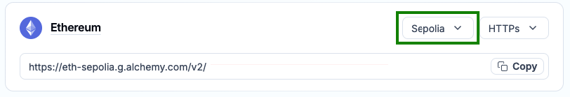
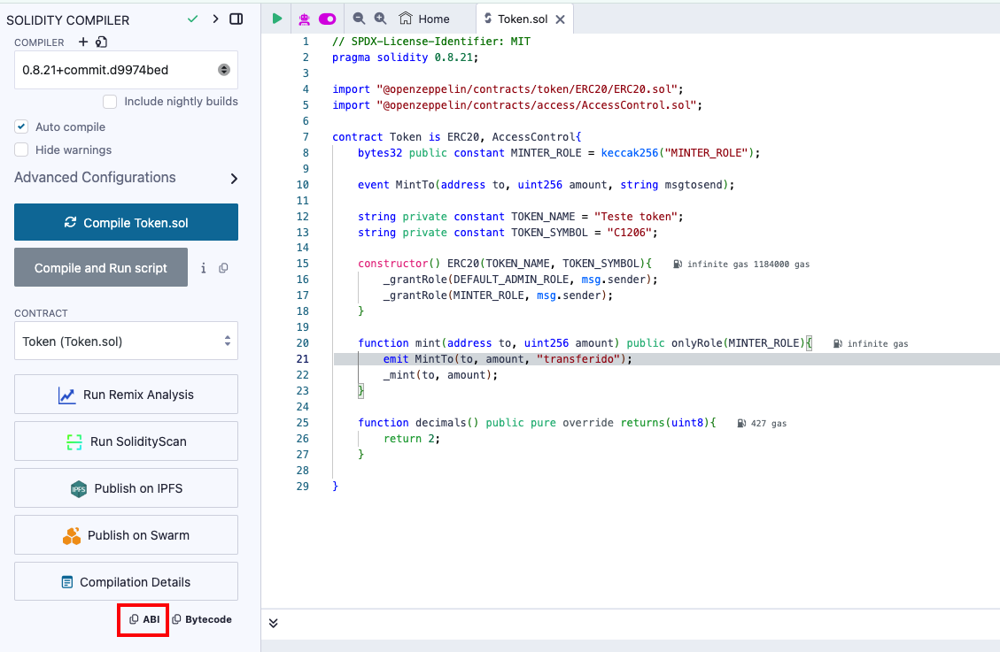

# listening-smartcontract
A JavaScript application that listens to an event emitted by a Solidity smart contract, using the ethers.js library.

## Env variables

- WEBSOCKET_URL= full Node WebSocket server URL
    - how can i get it? https://dashboard.alchemy.com/apps/x65nvq8vw2ufedak/networks
    
    
    

- CONTRACT_ADDRESS = contract address deployed to blockchain
    - how can i get it? https://remix.ethereum.org/#lang=en&optimize=false&runs=200&evmVersion=null&version=soljson-v0.8.21+commit.d9974bed.js
        - after the contract is deloyed, it will appear below the ABI field, as in the figure below

